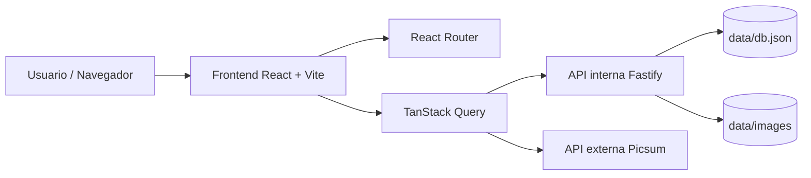
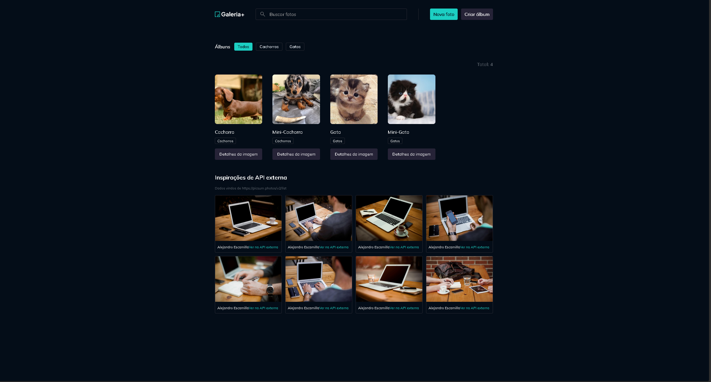
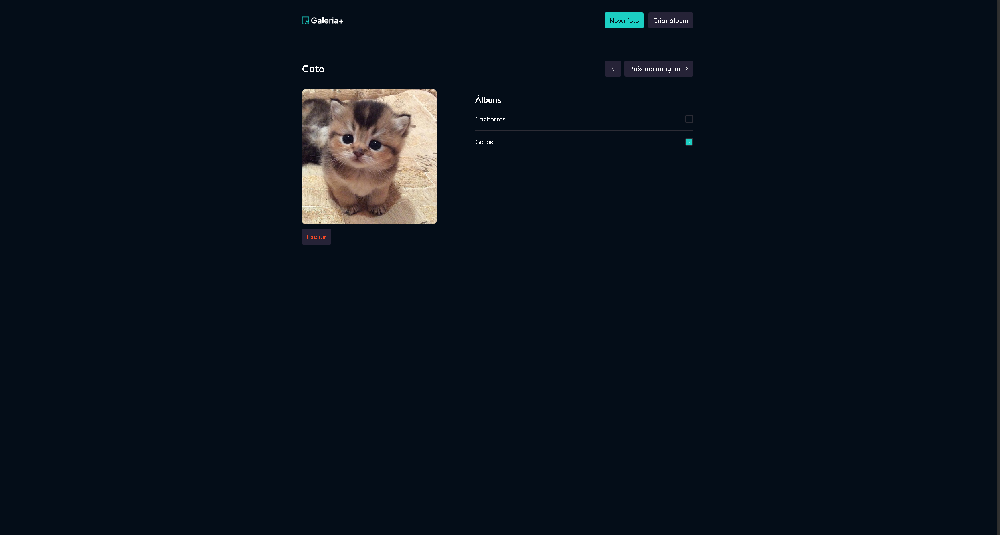
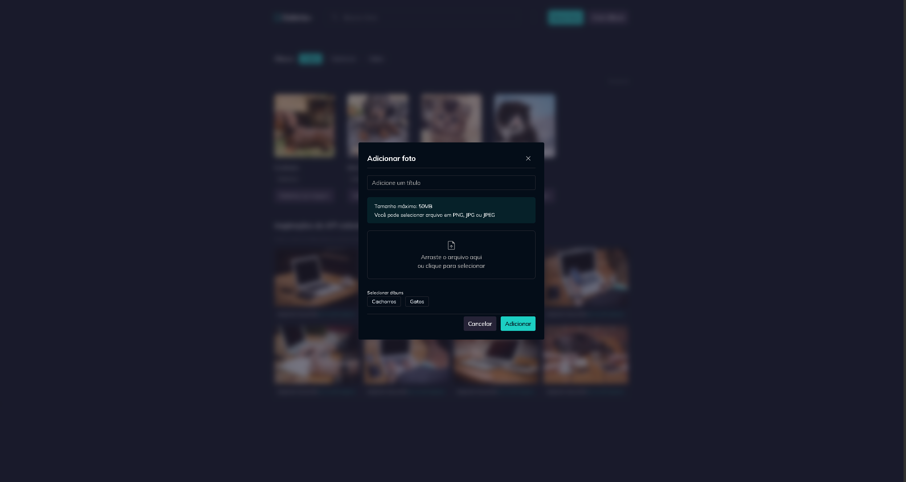

# Gallery Plus

Aplicacao React para gerenciamento e visualizacao de fotos e albuns, com consumo de API propria e API externa.

## Demo online

- Frontend: ADICIONE_AQUI_O_LINK_DA_APLICACAO
- Backend/API: ADICIONE_AQUI_O_LINK_DA_API

## Tema do projeto

Galeria de fotos com albuns e pagina de detalhes por foto.

## Requisitos da atividade atendidos

- Consumo de API com exibicao de dados.
- Rotas dinamicas com links internos.
- Projeto React versionado no GitHub.
- Arquitetura documentada neste README.

## APIs utilizadas

- API interna do projeto (Fastify):
  - `GET /photos`
  - `GET /photos/:id`
  - `GET /albums`
  - `POST /photos`
  - `POST /albums`
- API externa publica (sem autenticacao):
  - `https://picsum.photos/v2/list?page=1&limit=8`

## Tecnologias

- React 19
- TypeScript
- Vite
- React Router
- TanStack Query
- Axios
- Tailwind CSS
- Fastify
- Zod

## Arquitetura da aplicacao



## Estrutura de pastas (resumo)

```text
src/
	pages/                  # paginas e rotas
	contexts/albums/        # logica e componentes de albuns
	contexts/photos/        # logica e componentes de fotos
	contexts/external/      # consumo da API externa (Picsum)
	components/             # componentes reutilizaveis de UI
server/
	photos/                 # rotas e servicos de fotos
	albums/                 # rotas e servicos de albuns
	services/               # acesso a dados e imagens
data/
	db.json                 # base local
	images/                 # arquivos de imagem
```

## Como executar localmente

### 1) Pre-requisitos

- Node.js 20+
- pnpm

### 2) Instalar dependencias

```bash
pnpm install
```

### 3) Configurar variaveis de ambiente do frontend

Crie um arquivo `.env` na raiz com:

```env
VITE_API_URL=http://localhost:5799
VITE_IMAGES_URL=http://localhost:5799/images
```

### 4) Rodar backend

```bash
pnpm dev-server
```

### 5) Rodar frontend

Em outro terminal:

```bash
pnpm dev
```

## Build de producao

```bash
pnpm build
```

## Deploy (frontend + backend)

### Backend no Render

1. Suba este repositorio no GitHub.
2. No Render, clique em New + e selecione Blueprint.
3. Selecione este repositorio para usar o arquivo `render.yaml`.
4. Aguarde o deploy e copie a URL publica da API (exemplo: `https://gallery-plus-api.onrender.com`).

### Frontend na Vercel

1. Na Vercel, clique em Add New Project e importe este repositorio.
2. Framework: Vite (detectado automaticamente).
3. Este repositorio contem frontend e backend no mesmo projeto, mas na Vercel sera feito somente o build do frontend via `pnpm build-frontend` (ja configurado em `vercel.json`).
4. Configure as variaveis de ambiente do frontend:
   - `VITE_API_URL` = URL publica da API no Render
   - `VITE_IMAGES_URL` = URL publica da API + `/images`
5. Execute o deploy e copie a URL publica do frontend.

### Atualizacao final no README

Depois do deploy, substitua em "Demo online":

- Frontend: URL da Vercel
- Backend/API: URL do Render

## Rotas da aplicacao

- `/` pagina inicial com lista de fotos e filtros.
- `/fotos/:id` rota dinamica para detalhes da foto.
- `/componentes` pagina de componentes.

## Prints da aplicacao

Adicione capturas reais do seu projeto para a entrega:

- Home
  - 
- Detalhes da foto (rota dinamica)
  - 
- Cadastro de foto/album (opcional)
  - 

## Link do repositorio

- GitHub: ADICIONE_AQUI_O_LINK_DO_SEU_REPOSITORIO

## Observacao sobre persistencia no plano gratuito

No plano gratuito de alguns provedores, o sistema de arquivos pode ser efemero. Isso pode impactar uploads salvos em `data/images` apos reinicio/redeploy do servico.
